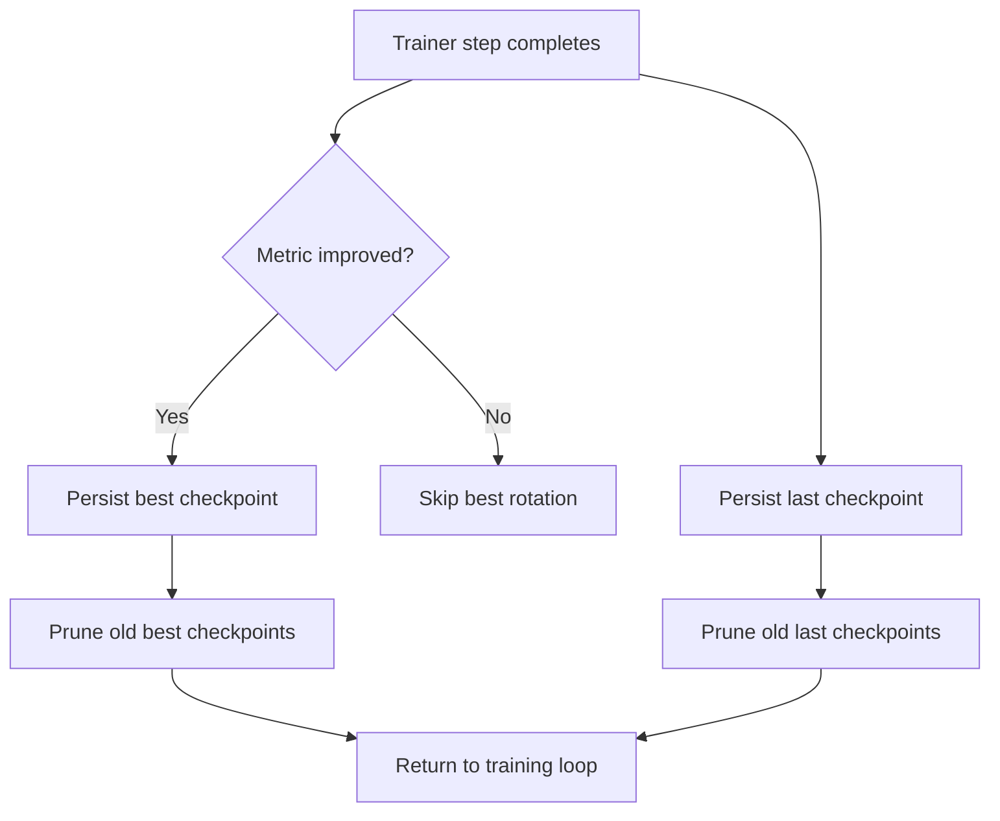

# ml_playground Architecture Overview

<details>
<summary>Related documentation</summary>

- [Developer Guidelines Index](./Readme.md) – Entry point for principles, quick-start commands, and cross-links to each guideline.
- [Development Practices](./DEVELOPMENT.md) – Commit standards, tooling policies, and high-level architecture notes.
- [Testing Standards](./TESTING.md) – Enforcement of TDD, coverage, and deterministic test suites.
- [Framework Utilities](../docs/framework_utilities.md) – Shared infrastructure for configuration, datasets, and runtime helpers.

</details>

## Table of Contents

- [Overview](#overview)
- [Configuration System](#configuration-system)
- [Dataset Lifecycle](#dataset-lifecycle)
- [Runtime Entry Points](#runtime-entry-points)
- [Checkpointing System](#checkpointing-system)
  - [Policies](#policies)
  - [Runtime Behaviour](#runtime-behaviour)
  - [Filesystem Responsibilities](#filesystem-responsibilities)
  - [Error Handling](#error-handling)
  - [Checkpoint Rotation Flow](#checkpoint-rotation-flow)
- [Future Extensions](#future-extensions)

## Overview

The `ml_playground` stack is organized around a strictly validated configuration pipeline, deterministic dataset preparation, Typer-powered runtime commands, and a checkpointing service that enforces explicit retention policies. This document assembles the architectural context that was previously scattered across multiple guideline files.

## Configuration System

- Configuration is sourced from TOML files and loaded through `ml_playground.configuration.loading`.
- Defaults live in `src/ml_playground/experiments/default_config.toml`; experiment overrides (for example `src/ml_playground/experiments/shakespeare/config.toml`) are merged on top.
- The loader:
  - Parses TOML using strict UTF-8 encoding.
  - Resolves relative paths with respect to the configuration file.
  - Coerces strings to `pathlib.Path` before validation.
  - Injects required runtime context (logger, device metadata) prior to Pydantic validation.
- Environment overrides (`ML_PLAYGROUND_TRAIN_OVERRIDES`, `ML_PLAYGROUND_SAMPLE_OVERRIDES`) are deep-merged, validated, and rejected if invalid.
- Use `configuration.loading.load_experiment_toml()` or `load_full_experiment_config()`; do not reimplement merge logic elsewhere.

## Dataset Lifecycle

- Datasets are generated via `uv run python -m ml_playground.cli prepare <experiment> --config <path>`.
- Preparers must write `train.bin`, `val.bin`, and `meta.pkl` into the dataset directory.
- `meta.pkl` creation is mandatory and standardized through helpers such as `ml_playground.prepare.write_bin_and_meta()`.
- Runtime commands fail fast when required artifacts are missing:
  - `train`: requires `train.data.meta_path`.
  - `sample`: accepts either `train.data.meta_path` or `<sample.runtime.out_dir>/<experiment>/meta.pkl`.
  - `loop`: skips `prepare` only when all artifacts already exist.

## Runtime Entry Points

- Typer CLI module `src/ml_playground/cli.py` exposes `prepare`, `train`, `sample`, and `loop` commands.
- Invoke runtimes directly:
  ```bash
  uv run python -m ml_playground.cli train shakespeare --config src/ml_playground/experiments/shakespeare/config.toml
  ```
- CLI commands remain thin coordinators that pass validated configuration into the training pipeline. Avoid wrapping them with additional `/tools` shims.

## Checkpointing System

### Policies

- Configured via `RuntimeConfig.checkpointing`.
- Independent retention windows:
  - `checkpointing.keep.last` controls rotating "last" checkpoints.
  - `checkpointing.keep.best` controls "best" checkpoints (keyed by evaluation metric).
- Values must be non-negative integers; rotation enforces the exact count (0 disables retention).

### Runtime Behaviour

- First checkpoint is persisted immediately after model initialization (cold start safety net).
- During training:
  - "Last" checkpoints rotate on a fixed cadence (for example every N iterations or after each epoch, depending on the trainer configuration).
  - "Best" checkpoints persist whenever the tracked validation metric improves.
- Checkpoints capture: model weights, optimizer state, model arguments, iteration counters, best metric, configuration snapshot, and optional EMA weights.

### Filesystem Responsibilities

- Checkpoint files follow strict naming patterns:
  - Last checkpoints: `ckpt_last_XXXXXXXX.pt`.
  - Best checkpoints: `ckpt_best_XXXXXXXX_<metric>.pt` (metric slug sanitized).
- Rotation is write-only; consumers must delete or archive old checkpoints explicitly if retention values change.
- Configuration loader is the single boundary for filesystem interaction related to configuration. Downstream modules should consume validated `Path` values without additional probing.

### Error Handling

- Invalid configuration (negative retention count, unsupported patterns) fails fast during validation.
- Loading a checkpoint validates schema integrity before resuming training.
- Runtime commands surface missing artifacts as explicit errors; silent fallbacks are forbidden.

### Checkpoint Rotation Flow



## Future Extensions

- Document secondary systems (sampler pipelines, logging infrastructure, distributed training) as they evolve.
- Track architecture diagrams alongside this file to keep developer onboarding concise.
