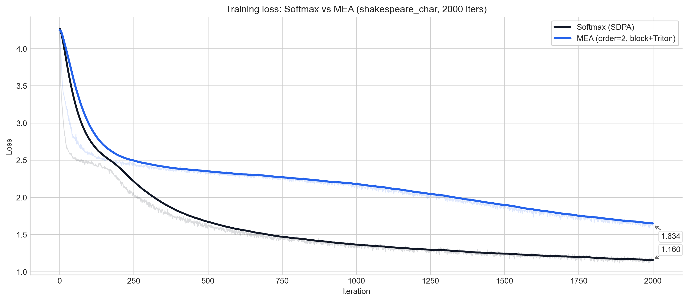
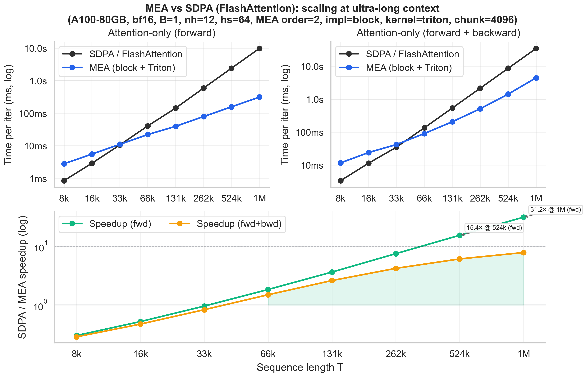
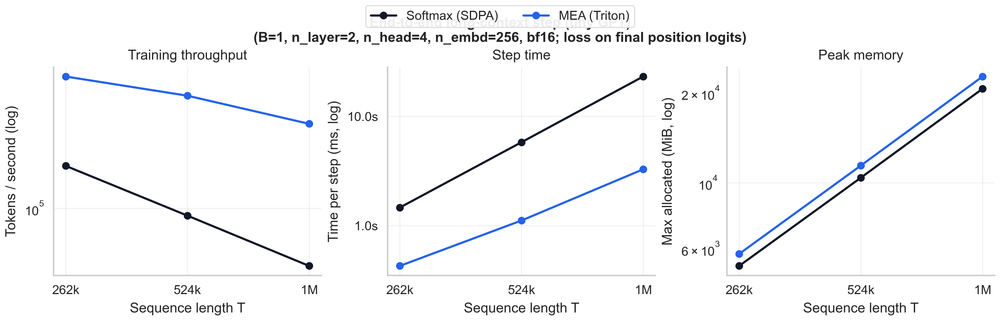
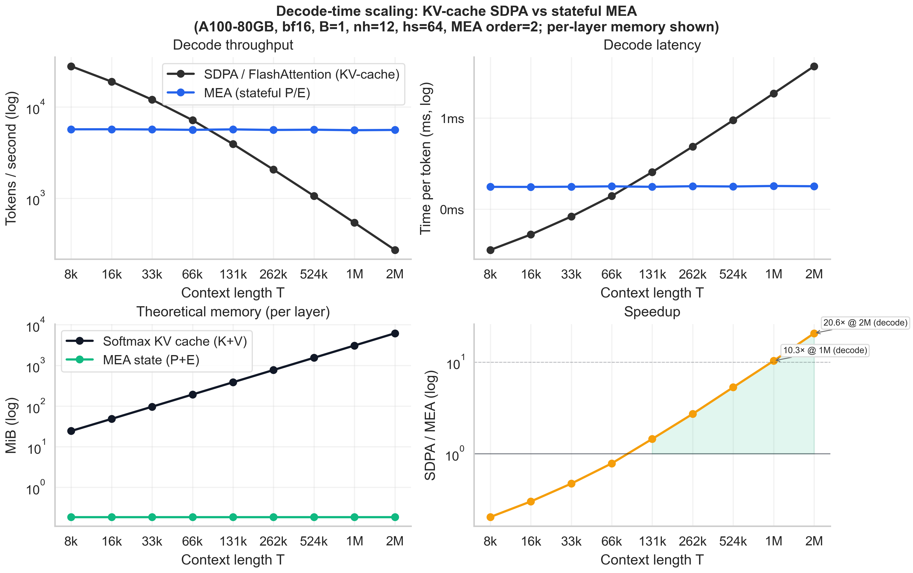

# MEA in nanoGPT (experimental)

This repo includes an **experimental** integration of **Matrix Exponential Attention (MEA)** as an alternative attention backend.

## What’s implemented

- `attn_type='mea'` option in `nanogpt/model.py` that replaces softmax attention with a truncated Taylor series:
  - Order `H=0`: `V`
  - Order `H=1`: `V + A V`
  - Order `H=2`: `V + A V + 1/2 A^2 V`
- Causal masking is enforced by construction (strictly lower-triangular / autoregressive).
- Two reference implementations are provided (`mea_impl`):
  - `block` (default): materializes only `chunk×chunk` score blocks `A = QKᵀ` and is usually faster/more autograd-friendly.
  - `scan`: streaming scan implementation that keeps per-token prefix states within each chunk.
- For `mea_impl=block`, you can pick the inner-kernel implementation (`mea_kernel`):
  - `torch` (default): uses PyTorch matmuls + `.tril()` masking (simple, often fast, higher peak memory).
  - `triton` (experimental): uses a fused Triton triangular matmul + custom backward (lower peak memory; chunk-size tuning matters).

### Optional stability tweaks (RetNet-style)

These options can help stabilize training, but they **change the operator** (i.e. it is no longer “pure” MEA as defined by the Taylor series alone):

- `mea_qk_l2norm=True`: L2-normalize Q/K per token/head (cosine-style) before forming dot products.
- `mea_out_groupnorm=True`: apply per-head `GroupNorm` on the concatenated head outputs (token-wise; does not mix across time).
- `mea_out_gate=True`: apply a SiLU (“swish”) output gate computed from the input, similar to RetNet’s gated retention blocks.

Note: `mea_fp32_accum=True` improves numerical stability by accumulating the cross-chunk recurrent summaries (`P/E`) in fp32 while keeping Q/K/V (and the main triangular matmuls) in the model dtype (bf16/fp16). This avoids the huge slowdown of “full fp32 attention” while still reducing long-context numeric drift.

## How to run

### Correctness check (streaming vs naive reference)

```bash
python mea_check.py
```

### Numerics report (error range + long-T stability)

Small-T (bf16 vs fp32 naive masked reference; produces an “error range” you can quote):

```bash
python mea_numerics_report.py --dtype=bf16 --small_Ts=64,128,256 --order=2 --chunk=64 \
  --json_out=plots/data/mea_numerics_small_bf16.json
```

Large-T stability (bf16; checks finiteness/scale at ultra-long T):

```bash
python mea_numerics_report.py --dtype=bf16 --skip_small --impls=block_triton --order=2 --chunk=4096 \
  --large_Ts=262144,1048576,2097152 --json_out=plots/data/mea_stability_large_bf16.json
```

Large-T bf16 vs fp32 *MEA reference* (same impl/kernel/inputs; this is **not** the O(T²) naive reference, which is infeasible at 1M+):

```bash
python mea_numerics_report.py --dtype=bf16 --skip_small --compare_large_to_fp32 --impls=block_triton --order=2 --chunk=4096 \
  --large_Ts=262144,1048576,2097152 --fp32_accum=false --json_out=plots/data/mea_large_compare_bf16_to_fp32.json

python mea_numerics_report.py --dtype=bf16 --skip_small --compare_large_to_fp32 --impls=block_triton --order=2 --chunk=4096 \
  --large_Ts=262144,1048576,2097152 --fp32_accum=true --json_out=plots/data/mea_large_compare_bf16_fp32accum_to_fp32.json
```

FP32 feasibility at long T (forward-only MEA in fp32):

```bash
python mea_numerics_report.py --dtype=fp32 --skip_small --impls=block_triton --order=2 --chunk=4096 \
  --large_Ts=262144,1048576,2097152 --fp32_accum=false --json_out=plots/data/mea_stability_large_fp32.json
```

Tip: add `--allow_tf32=false` if you want the fp32 reference to avoid TF32 matmuls (slower but more “fp32-like”).

Measured numbers (single A100-SXM4-80GB, `torch.manual_seed(0)`, random inputs with `input_std=0.02`, `allow_tf32=true`).
These tables are copied from the JSON artifacts committed in `plots/data/`:

- Small-T: `plots/data/mea_numerics_small_bf16.json`
- Large-T compare: `plots/data/mea_large_compare_bf16_to_fp32.json`, `plots/data/mea_large_compare_bf16_fp32accum_to_fp32.json`
- FP32 feasibility: `plots/data/mea_stability_large_fp32.json`

Small-T bf16 vs fp32 *naive masked* reference (`order=2`, `chunk=64`, `impl=block`, `kernel=triton`):

| T | `l2_rel` (`fp32_accum=false`) | `l2_rel` (`fp32_accum=true`) | `max_abs` |
|---:|---:|---:|---:|
| 64  | 0.209% | 0.209% | 2.68e-4 |
| 128 | 0.218% | 0.218% | 3.98e-4 |
| 256 | 0.226% | 0.226% | 4.73e-4 |

Large-T bf16 vs fp32 *MEA* reference (`order=2`, `chunk=4096`, `impl=block`, `kernel=triton`):

| T | `l2_rel` (`fp32_accum=false`) | `l2_rel` (`fp32_accum=true`) | `max_abs` (`false/true`) |
|---:|---:|---:|---:|
| 262k | 0.308% | 0.237% | 7.71e-4 / 5.06e-4 |
| 1M   | 0.531% | 0.244% | 1.19e-3 / 5.48e-4 |
| 2M   | 0.902% | 0.253% | 2.61e-3 / 7.30e-4 |

FP32 feasibility (forward-only MEA in fp32, same `order/chunk/impl/kernel`):

| T | Peak alloc (MiB) | Time (ms) | Finite |
|---:|---:|---:|:---:|
| 262k | 4424 | 1094 | yes |
| 1M   | 17672 | 2738 | yes |
| 2M   | 35336 | 5503 | yes |

Numbers will vary slightly across runs/hardware/settings, but this is the typical magnitude.

### Loss curve (Shakespeare-char, same hyperparams)

This compares `attn_type=softmax` vs `attn_type=mea` using the same training config (Shakespeare-char). These are **measured** runs on a single A100-80GB, with eval disabled (for speed) and logging every iter.

Commands:

```bash
python data/shakespeare_char/prepare.py

python train.py config/train_shakespeare_char.py \
  --out_dir=out-loss-softmax --attn_type=softmax \
  --max_iters=2000 --eval_interval=1000000000 --log_interval=1 --compile=False

python train.py config/train_shakespeare_char.py \
  --out_dir=out-loss-mea --attn_type=mea --mea_order=2 --mea_impl=block --mea_kernel=triton --mea_chunk_size=256 --mea_fp32_accum=True \
  --max_iters=2000 --eval_interval=1000000000 --log_interval=1 --compile=False
```

Plot (from `plots/data/loss_curve_shakespeare_char_*.json`):



### Training smoke test (uses `torch.compile` if enabled)

```bash
python data/shakespeare_char/prepare.py

python train.py config/train_shakespeare_char.py \
  --out_dir=out-shakespeare-char-mea-smoke \
  --attn_type=mea --mea_order=2 --mea_impl=block --mea_kernel=triton --mea_chunk_size=256 \
  --max_iters=20 --eval_interval=20 --eval_iters=20 --log_interval=1 \
  --compile=True
```

### Attention-only benchmark (SDPA vs MEA)

Forward+backward:

```bash
python mea_bench_attn.py --T=262144 --mode=fwd_bwd --dtype=bf16 --impl=block --kernel=triton --chunk=4096 --iters=1 --warmup=1
```

Forward-only:

```bash
python mea_bench_attn.py --T=262144 --mode=fwd --dtype=bf16 --impl=block --kernel=triton --chunk=4096 --iters=3 --warmup=1
```

### Benchmark sweeps (tables)

```bash
python mea_sweep_attn.py --Ts=8192,16384,32768,65536,131072,262144 --mode=fwd_bwd --dtype=bf16 --impl=block --kernel=triton --chunk=4096 --iters=1 --warmup=1
python mea_sweep_attn.py --Ts=262144,524288,1048576 --mode=fwd --dtype=bf16 --impl=block --kernel=triton --chunk=4096 --iters=1 --warmup=1
```

### Decode-time benchmark (KV-cache vs stateful MEA)

This measures *decode-only* throughput/latency for `q_len=1` generation, comparing:

- SDPA (FlashAttention) with a growing KV cache (`O(T)` per token)
- MEA with constant-size recurrent state `P/E` (`O(1)` per token)

```bash
python mea_decode_bench.py --Ts=8192,16384,32768,65536,131072,262144,524288,1048576,2097152 --decode=128 --dtype=bf16 --order=2 --fp32_state=0 --iters=3 --warmup=1
```

### End-to-end training smoke (tiny GPT, long context)

This script times a single optimizer step while computing loss only on the final position logits (the forward pass still runs the full sequence):

```bash
python mea_train_smoke.py --attn_type=mea --T=262144 --B=1 --n_layer=2 --n_head=4 --n_embd=256 --dtype=bf16 --mea_kernel=triton --mea_chunk=4096 --warmup=1 --iters=1
python mea_train_smoke.py --attn_type=softmax --T=262144 --B=1 --n_layer=2 --n_head=4 --n_embd=256 --dtype=bf16 --warmup=1 --iters=1
```

## Notes on performance

This implementation is intended as a **baseline integration** that is easy to read/modify.

- For typical context sizes (e.g. `T <= 16k`), PyTorch SDPA/FlashAttention is usually much faster.
- MEA’s scaling advantage can show up at **very long sequence lengths**, but *only once you are far enough out* that quadratic attention is costly.
- `mea_kernel=triton` avoids materializing `chunk×chunk` score blocks and can substantially reduce peak memory. It also changes the best `chunk` size: on A100, larger chunks (e.g. `4096`) can work well.

### Measured results (single A100-SXM4-80GB, PyTorch 2.9.1+cu128)

Attention-only benchmark (`B=1, nh=12, hs=64, dtype=bf16, impl=block, order=2, fp32_accum=False`):

Plots (generated from `plots/data/*.json` via `plots/plot_mea_results.py`):







**Torch kernel** (`kernel=torch, chunk=2048`):

| T | SDPA (fwd+bwd) | MEA (fwd+bwd) | Speedup |
|---:|---:|---:|---:|
| 65,536  | 135 ms | 95 ms  | **1.43×** |
| 131,072 | 535 ms | 228 ms | **2.35×** |
| 262,144 | 2141 ms | 647 ms | **3.31×** |

**Triton kernel** (`kernel=triton, chunk=4096`):

| T | SDPA (fwd+bwd) | MEA (fwd+bwd) | Speedup |
|---:|---:|---:|---:|
| 16,384  | 11.3 ms | 23.8 ms | 0.47× |
| 32,768  | 34.7 ms | 41.7 ms | 0.83× |
| 65,536  | 134.8 ms | 90.1 ms | **1.50×** |
| 131,072 | 535.2 ms | 205.1 ms | **2.61×** |
| 262,144 | 2141.9 ms | 509.1 ms | **4.21×** |
| 524,288 | 8609.4 ms | 1414.0 ms | **6.09×** |
| 1,048,576 | 34,572.1 ms | 4425.2 ms | **7.81×** |

Forward-only can be even more favorable (especially for ultra-long-context inference):

| T | SDPA (fwd) | MEA (fwd) | Speedup |
|---:|---:|---:|---:|
| 262,144 | 591 ms | 79.1 ms | **7.48×** |
| 524,288 | 2410 ms | 156.9 ms | **15.37×** |
| 1,048,576 | 9771 ms | 313.1 ms | **31.21×** |

End-to-end training smoke (single optimizer step, A100-SXM4-80GB, bf16, `B=1, n_layer=2, n_head=4, n_embd=256`, loss on final position logits):

| T | Softmax step | MEA step (`kernel=triton, chunk=4096`) | Speedup |
|---:|---:|---:|---:|
| 262,144 | 1460 ms | 427 ms | **3.42×** |
| 524,288 | 5792 ms | 1112 ms | **5.21×** |
| 1,048,576 | 23,142 ms | 3274 ms | **7.07×** |

If you need MEA to be compelling at smaller `T`, the next steps are typically:

- Further kernel tuning (or a more FlashAttention-like backward).
- Layer-level integration that fuses more of the MEA block math (vs only the triangular matmul pieces).

### Notes on bitwise alignment

Different kernels/backends will generally **not** be bitwise-identical due to non-associativity of floating point math and different reduction orders/parallelism. For validation, prefer `torch.allclose` with a reasonable tolerance (and compare in fp32 when possible).
