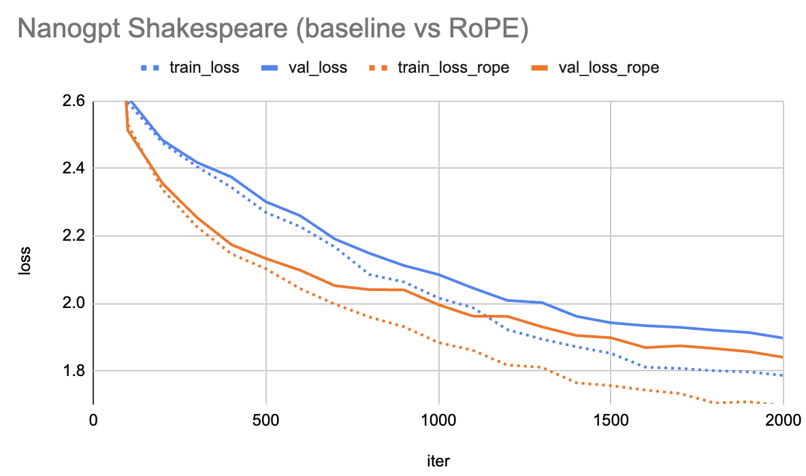

# nanoGPT clone + RoPE embedding

This repo adds [RoPE](https://arxiv.org/abs/2104.09864) to [nanoGPT](https://github.com/karpathy/nanoGPT) (reimplementation of GPT-2). Rotary positional embeddings (RoPE) enables self-attention to be a function of relative distance between tokens. This is one the main ingredients of newer LLMs (Llama...) compared to GPT2 and the original transformer architecture.

Trained on the toy Shakespeare dataset on CPU only. RoPE achives better convergence and lower validation loss.



## Setup

```
pip install torch numpy transformers datasets tiktoken wandb tqdm
```

Training on CPU on a small transformer (4 layers). To use RoPE, set `--rope_embedding=True`.

### Baseline
```
python train.py config/train_shakespeare_char.py --device=cpu --compile=False --eval_iters=40 --eval_interval=100 --log_interval=1 --block_size=64 --batch_size=12 --n_layer=4 --n_head=4 --n_embd=128 --max_iters=2000 --lr_decay_iters=2000 --dropout=0.0
```

### Baseline (+ RoPE embedding)
```
python train.py config/train_shakespeare_char.py --device=cpu --compile=False --eval_iters=40 --eval_interval=100 --log_interval=1 --block_size=64 --batch_size=12 --n_layer=4 --n_head=4 --n_embd=128 --max_iters=2000 --lr_decay_iters=2000 --dropout=0.0 --rope_embedding=True --out_dir=out-shakespeare-char-rope

```


Train and validation losses are saved in `out-shakespeare-char/losses.csv` and `out-shakespeare-char-rope/losses.csv`.

## RoPE

In the original transformer, absoulte positional information was added to the inputs and key/query dot-product was computed as follows.

${q^T_m}{k_n} = (W_q(x_m+p_m))^T(W_k(x_n+p_n))$

The dot-product is a function of $f(x_m,x_n,m,n) = f_q(x_m,m)^Tf_k(x_n,n)$.

The idea of RoPE is to make the dot-product a function of the *relative*position (*m-n*).

$g(x_m,x_n,m-n) = g_q(x_m,m)^Tg_k(x_n,n)$

This is achieved by making (in the 2D case and for query only, but same applies to key):

$g_q(x_m,m)=\begin{pmatrix} \cos(m\theta)  & -\sin(m\theta) \\ \sin(m\theta) & \cos(m\theta) \end{pmatrix}\begin{pmatrix} W^{1,1}_q  & W^{1,2}_q \\ W^{2,1}_q &W^{2,2}_q \end{pmatrix}\begin{pmatrix} x^1_m \\ x^2_m \end{pmatrix}$

The new matrix is a complex-plane rotation matrix. For D higher than 2 and even, we can write it as (4D case):

$\begin{pmatrix} \cos(m\theta_1)  & -\sin(m\theta_1) &0&0 \\ \sin(m\theta_1) & \cos(m\theta_1)&0&0 \\0&0&\cos(m\theta_2)  & -\sin(m\theta_2)  \\ 0&0&\sin(m\theta_2) & \cos(m\theta_2)\end{pmatrix}$

, where $\theta_d=b^{-2d/D}$ and $b=10000$.


## acknowledgements

[Karpathy](https://github.com/karpathy) for creating the nanoGPT repo.
