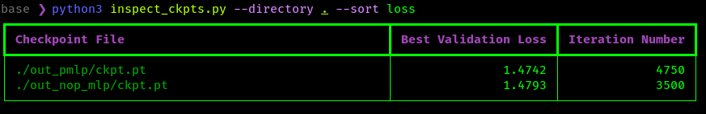

# ReaLLMASIC

## Overview

ReaLLMAsic aims to bridge the gap between theoretical model design and practical
hardware implementation, ensuring efficient, scalable, and robust ML model
development.

Our project stands out for its extensive exploration of various model
configurations and modules, catering to a diverse range of use cases.

Key exploration features include:

* `Module Variation`: Explore with different module types -- e.g. Softmax, Softermax, ConSmax, and SigSoftmax -- discover which is best suited (PPA) to your application.
* `Flexible Tokenization`: Explore different tokenization: tiktoken, sentencepiece, phonemization, character level, custom tokenization, etc.
* `Diverse Dataset Performance Testing`: Evaluate model efficacy across various languages and datasets including: csv-timeseries, mathematics, music, lyrics, literature, and webtext.
* `Standard and Custom Hyperparameters`: Fine-tune models using conventional hyperparameters and explore the impact of custom settings on model performance and PPA impacts.

Key analysis features:

* `Exploration scripts`: Are encapsulated into bash scripts which loop over the train.py's argparse parameters.
* `Logging with automatic timestamps & labels`: run a suite of experiments and have the repo automatically organize and label them by timestamp and description

Hardware Related
* `Training with Hardware Emulation`: Implement different operations for forward and backward passes for hardware-implementation aware training.
* `PPA Implications Analysis`: Understand the power, performance, and area (PPA) implications of different model designs, guiding efficient hardware-software integration.


# TOC

* [Overview](#overview)
* [Installation](#installation)
  * [Step 1 (Recommended) Adding a Virtual Env](#step-1-recommended-adding-a-virtual-env)
  * [Step 2 Install Dependencies](#step-2-install-dependencies)
* [Testing Your Setup](#testing-your-setup)
  * [Prepare Training and Validation Data Sets](#prepare-training-and-validation-data-sets)
  * [Train Model From Scratch](#train-model-from-scratch)
  * [Perform Inference From Custom Model](#perform-inference-from-custom-model)
* [Explorations](#explorations)
  * [Start Exploration](#start-exploration)
  * [Inspect and Monitor Best Val Losses](#inspect-and-monitor-best-val-losses)
  * [Start Tensorboard Logging](#start-tensorboard-logging)
  * [Troubleshooting](#troubleshooting)
  * [Creating New Features and Exploration Scripts](#creating-new-features-and-exploration-scripts)
* [Contributing](#contributing)
* [Acknowledgements](#acknowledgements)

## Installation

This section contains installation locally with GPU acceleration.

(If you do not have a GPU, check out this [colab](./NanoGPT_Quickstart.ipynb), which has a T4 GPU
runtime (at time of writing) for ML acceleration.)

### Step 1 (Recommended) Adding a Virtual Env

We recommend creating a virtual env or conda environment before starting:

For venv:
```bash
python3 -m venv venv
source venv/bin/activate
```

Or for conda:
```bash
conda create -n nanogpt
conda activate nanogpt
```

### Step 2 Install Dependencies

If you are compatible with cu11.8, then use the following:

```bash
python3 -m pip install --upgrade pip
python3 -m pip install torch torchvision torchaudio --index-url https://download.pytorch.org/whl/cu118
python3 -m pip install numpy transformers datasets tiktoken wandb tqdm tensorboard rich torchinfo
```

If unsure, visit the pytorch page and subtitute the appropriate line for the `torch` installation line above: https://pytorch.org/get-started/locally/

## Testing Your Setup

### Prepare Training and Validation Data Sets

This downloads and parses a literature dataset into `train.bin` and `val.bin` files.

```bash
python3 data/shakespeare_char/prepare.py
```
### Train Model From Scratch

Training with a GPU is highly recommended, to do this now run (should take
around 3-20 minutes depending on one's GPU):

```bash
python3 train.py --device="cuda" --dataset="shakespeare_char" --out_dir="out_shakespeare_char"
```

The first line will show the current configuration settings for the training for
reference, including softmax type, positional embedding settings, and
conventional hyperparameters (number of layers and heads, etc.).

### Perform Inference From Custom Model

minutes and the best validation loss is 1.4697. Based on the configuration, the
model checkpoints are being written into the `--out_dir` directory
`out-shakespeare-char`. So once the training finishes we can sample from the
best model by pointing the sampling script at this directory:

```bash
python3 sample.py --out_dir="out_shakespeare_char" --device="cuda"
```

This generates a few samples, for example:

```
ANGELO:
And cowards it be strawn to my bed,
And thrust the gates of my threats,
Because he that ale away, and hang'd
An one with him.

DUKE VINCENTIO:
I thank your eyes against it.
```

This looks pretty good for a model which just learned how to spell from scratch.
Keeping an eye on inference is very important, however, usually one can infer
levels from validation losses.

The next section goes over how to do a massive _exploration_ of different models
and quickly compare their quality using the `validation loss` as a proxy.

## Explorations

The explorations directory is intended to be have a set of fully encapsulated
replicable sweeps.

Using these, one can quickly and visually compare ultimate quality of
checkpoints created from training using `validation loss` as a figure of merit.

### Start Exploration

To run the experiment create or modify an existing json file in the `explorations` folder:

```bash
python3 run_experiments.py --config explorations/config.json --output_dir out_test
```

This will create logs in the following directories:

```
csv_logs/
logs/
```

and save checkpoints for inference in `out_test`

### Inspect and Monitor Best Val Losses

Often for large explorations with `run_experiments` one wants to monitor the
the best validation losses so far (a metric for how well the model does on next
token prediction on the current dataset).

The included `inspect_ckpts.py` script reports the best valiation loss and
associated iteration number for all ckpt.pt files recursivel for a specified
parent directory.

Example usage:
```bash
python3 inspect_ckpts.py --directory ./out --sort loss
```



This can be wrapped with color via the watch command for a realtime dashboard.

For example to look at all checkpoint files in the out directory:
```bash
watch --color 'python3 inspect_ckpts.py --directory ./out --sort loss'
```

As with remainder of the repo, this script is provided as a base to open up for
additional community contributions.

### Start Tensorboard Logging

If using tensorboard for logging, we have provided a convenience script:

```bash
bash start_tensorboard.sh
```

You can view live validation loss updates on url: [http://localhost:6006](http://localhost:6006)

### Troubleshooting

Tensorboard script not starting?

Only one process can grab port 6006 at time, try closing other processes (e.g.
other tensorboards) using this port, or choose an alternative port.

## Contributing

This repo is under active development and accepting PR's, please see the

See the [Contributing_Features.md](Contributing_Features.md) for details on how
to add new features and explorations.

## Acknowledgements

- Original nanoGPT Repo
- NanoGPT Discord Channel [](https://discord.gg/3zy8kqD9Cp)
- [Zero To Hero series](https://karpathy.ai/zero-to-hero.html)
- [GPT video](https://www.youtube.com/watch?v=kCc8FmEb1nY)
